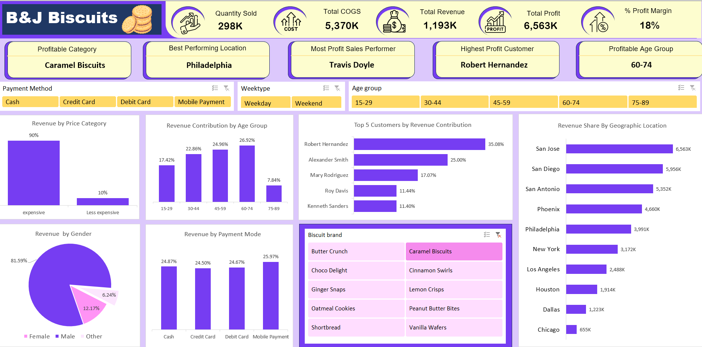

## 📊 Excel Sales Analysis Dashboard

### 📌 Objective
To analyze sales data and identify key profit drivers across customers, locations, product categories, age groups, and salespersons.

### 🛠 Tools Used
- Microsoft Excel
- Pivot Tables
- Pivot Charts
- KPI Cards

### 📈 Key KPIs
- Total Sales
- Total Profit
- Profit by Age Group
- Most Profitable Location
- Most Profitable Customer
- Most Profitable Salesperson
- Profit Margin
- Average Profit per Customer

### 🔍 Key Insights
- Certain customer segments and locations contribute the highest profit.
- A small group of customers generates a large share of total profit.
- Some product categories perform better than others in terms of profit.

### 📌 Conclusion
This dashboard helps businesses understand sales performance and make data-driven decisions to improve profitability.

## 📊 Dashboard Preview

